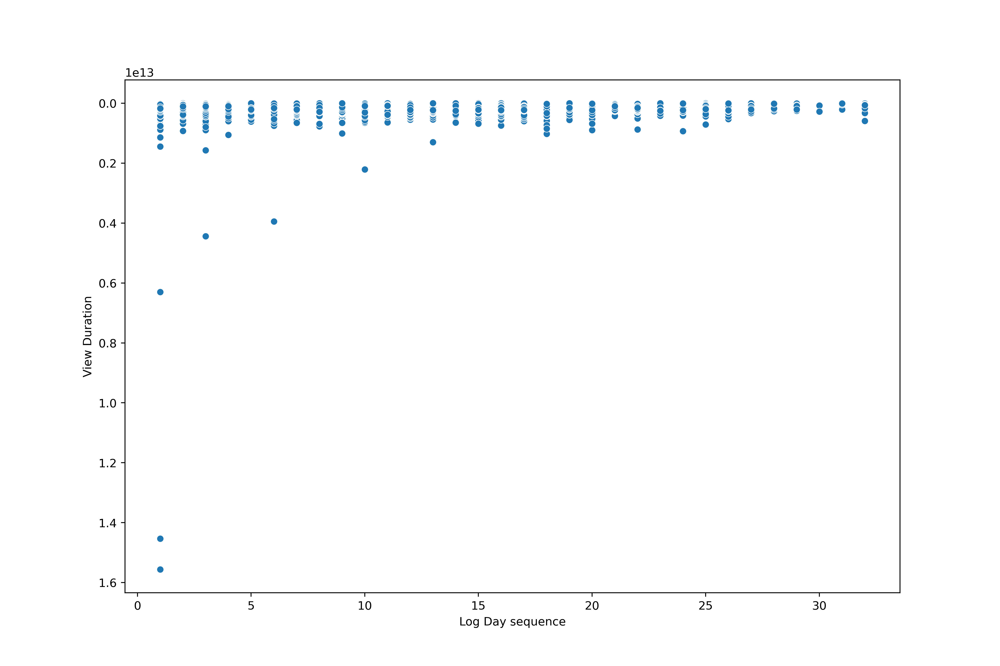

---
title:
- 小テスト

subtitle:
- 新規ユーザー利用率改善方法

author: |
 | [Thomas Czank](sendto:thomas.czank@gmail.com)

email:
- thomas.czank@gmail.com

urlcolor: red

theme:
- metropolis

fonttheme: professionalfonts
mainfont: "HaranoAjiMincho-Regular.otf"
mainfontoptions:
      - BoldFont=HaranoAjiMincho-Bold
      - ItalicFont=RobotoMono-LightItalic
sansfont: "NotoSans-Regular"
monofont: "migu-1c-regular.ttf"

themeoptions: "progressbar=foot, block=fill, background=light"

date:
- 2024年10月25日

header-includes:

- \usepackage{appendixnumberbeamer}
- \usepackage{booktabs}
- \usepackage{longtable}
- \usepackage{array}
- \usepackage{multirow}
- \usepackage{wrapfig}
- \usepackage{float}
- \usepackage{colortbl}
- \usepackage{pdflscape}
- \usepackage{tabu}
- \usepackage{xcolor}
- \usepackage{threeparttable}
- \usepackage{soul}
- \usepackage{minted}
- \usepackage{hyperref}
- \hypersetup{colorlinks=true, urlcolor=cyan, linkcolor=blue}
- \newcommand{\columnsbegin}{\begin{columns}}
- \newcommand{\columnsend}{\end{columns}}
- \AtBeginSubsection{}
- \AtBeginSection{}
- \makeatletter
- \setlength{\metropolis@titleseparator@linewidth}{2pt}
- \setlength{\metropolis@progressonsectionpage@linewidth}{2pt}
- \setlength{\metropolis@progressinheadfoot@linewidth}{2pt}
- \makeatother

fontsize: 10pt
---

# 目次

\tableofcontents

# 準備

\tableofcontents[currentsection]

## 環境設定

* 解析の**維持**
    1. `git`リポジトリ設定
    2. `conda/anaconda`環境設定
    3. **パッケージ**をインストール
    4. `env`環境のパッケージリストを`yml`ファイルにエクスポートする

この分析環境は、今後の**ソフトウェアアップデート**によって
壊れることを防ぐために十分にドキュメント化されています。

## 問題は？

* あるストリーミングサービス
    1. 新規利用者の**Monthly Active**日数が芳しくありません。
    2. 新規利用者の60%は利用初日`log_day_sequence = 1`しかサービスを利用していません。
    3. 新規利用者の二日目以降の利用率`log_day_sequence >= 2`は40％前後です。

* 新規利用者の二日目以降の利用率`log_day_sequence >= 2`を改善する方法は。
    1. データの各`column`チェックする
    2. `log_day_sequence = 1`の利用者の類似した特性は。類似していない特性は。
    3. `log_day_sequence >= 2(1)`の利用者の類似した特性は。類似していない特性は。

**新規利用者は履歴がないからどんな製作をお勧めすれば良い？**

## データは？

| #   | Column            |  Count   |  Non-null |  Dtype |
| ----| ----------------- | -------- | --------- | ------ |
|     |  `Unnamed: 0`     |   23242  | non-null  | int    |
| 0   |  `show_type`    |  23242   |  non-null | object |
| 1   |  `episode_id`  |  23242   |  non-null | object |
| 2   |  `show_id`  |  23242   |  non-null | object |
| 3   |  `user_id` |  23242   |  non-null | object |
| 4   |  `log_date`  |  23242   |  non-null | object |
| 5   |  `view_start_time` |  23242   |  non-null | object |
| 6   |  `view_end_time`     |  23242   |  non-null | object |
| 7   |  `view_percent` |  23242   |  non-null | float64 |
| 8   |  `log_day_sequence` (1:初日、2:2日目) |  23242   |  non-null | Int64 |

## 特徴量エンジニアリング - データクリーニング

* 不要な古いインデックスを削除しました。`Unnamed: 0`
* ヌル`null`記録ありますか。
* 数値ではない`NaN`記録ありますか。
* 調整はどうですか。

* 7`user_id` `NaN`です
* $7/23242 = 0.030\%$
* その記録は削除しても大丈夫です。
* 総数は23242 $\rightarrow$ 23235です。

## 特徴量エンジニアリング - データ変換

* 最初は、これらはすべて`object(string)`です。
    1. `log_date`
    2. `view_start_time`
    3. `view_end_time`

* `datetime`に変換して。
* 新しい変数計算した。
    1. `view_duration(s)`
    2. `log_date`割れた`year` `month` `day`

* `jpholiday`と言うパッケージは日本の祝日の確認。
    1. `is_workday` __boolean__ 変数作りました。

## 特徴量の概要

|  | `ep_type` | `ep_id`	| `show_id` | `user_id` | `log_date` |
|----- | ------  | ----- | ----- | ---- |-------- | 
|count |23235 |	23235 |	23235 |	23235 | 23235 |
|unique |	3 |	7275 | 384 | 999 | 60 |
|top |	b	| ep5 |	s4 |	uu43 | 2024-03-03 |
|freq |	13684 |	408 |	2253 |	1226 |	854 |

* __7275__ ユニーク _episodes_
* __384__ ユニーク _shows_
* __999__ ユニーク _users_
* 一番人気`episode_type`はb
* 一番人気`episode_id` は`ep00000005`
* 一番人気`show_id`は`s00000004`

# 問題の前提確認

\tableofcontents[currentsection]

## 新規利用者60\%初日しか使いません。

1. ログ日付とユーザーIDを
使用して初期のDataFrameを小さなDataFrameに分割する
2. カウンターとして使用するダミー変数を作成する
3. グループ化と合計

| | 1日あたりのログ記録回数 | 回数 |
|-| ------------------------| -----|
|0|　　　　　 1             | 612  |
|1| 　　　　　2             | 158  |
|2| 　　　　　3             | 58   |
|3| 　　　　　4             | 34   |
|4| 　　　　　5             | 18   |
|5| 　　　　　6             | 14   |
|6| 　　　　　8             | 13   |
|7| 　　　　　10            | 11   |

# 探索的データ解析(EDA)

\tableofcontents[currentsection]

## 特徴量エンジニアリング後のデータフレーム

{height=110%}

### 何を探している？
 1. 見やすいユーザーの割れる方法
 2. 新規利用者`log_day_sequence`により識別能力特徴は？

## 特徴チェック`episode_id`

## 特徴チェック`episode_type`

## 特徴チェック`show_id`

## 特徴チェック`user_id`

## 特徴チェック`view_start_time`

## 特徴チェック`view_end_time`

## 特徴チェック`view_duration`

## 特徴チェック`view_percent`

* 100以上の記録は？

## 特徴チェック`view_percent_norm`

`view_percent_norm = view_percent / log_day_sequence`

## 特徴チェック`log_date`

{height=100%}

## 特徴チェック`is_working_day`

## 特徴チェック`log_day_sequence`

## 2つの特徴量を組み合わせる `log_day_sequence` `view_duration`

* 外れ値が遠い

## `log_day_sequence < 2`と`log_day_sequence > 1`比較する`episode_id`

## `log_day_sequence < 2`と`log_day_sequence > 1`比較する`show_id`

## `log_day_sequence < 2`と`log_day_sequence > 1`比較する`episode_type`

## 探索的データ解析結論

1. いくつかのパラメータ周辺でデータの偏りが見られました。
2. このデータセットには、ログ日付の傾向を考慮すると、
より深刻な問題がある可能性があります。
3. ログインしているユーザーとそうでないユーザーを
より適切にグループ化するためには、
複数の特徴量を組み合わせた分析が必要です。
4. `episode_type` `show_id` `episode_id`は識別能力があります

# コサイン類似度

\tableofcontents[currentsection]

## ドット積

$\mathbf{a}\cdot\mathbf{b} = \|a\|\|b\|\cos{\theta}$

$\cos{0^\circ} = 1$
$\cos{90^\circ} = 0$

## コサイン類似度

1. `user_id`はベクトル化`[episode_id, show_id, episode_type]`
2. ユニークユーザーは999
3. 999 $\times$ 999行列
4. この行列計算すると全部のユーザーの類似度理解はできます
5. 行列並べ替えしたら新規利用者の`log_day_sequence >= 2`が細かくて改善できます

**残念ながら昨日の朝から今まで999x999行列の計算まだ続いています。**

# 講師なし機械学習

\tableofcontents[currentsection]

## K-Means clustering

1. encodeデータ`string` $\rightarrow$ `int, float`
2. いくつななクラスタは最適化

::: columns
:::: column

::::
:::: column

::::
:::

**このデータに簡単なK-meansあまり識別能力がない**

# 結論

\tableofcontents[currentsection]

## 結論

1. データを概観すると一番人気の`episode_id, episode_type, show_id`は見つかれます
    * 問題のシンプルな答えはそれを新規利用者にお勧めする方が良い
    * 人気がないのコンテンツをお勧めしない方が良い

2. ユーザーとユーザーの関係細かく分かったら
    * `view_percent`の影響も理解できます
    * ユーザーのグルーぷも理解できます

**ご清聴ありがとうございます**
